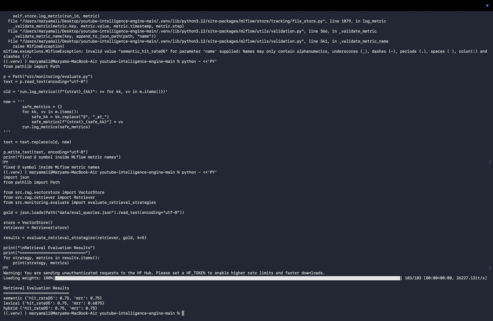

# YouTube Intelligence Engine

## CSCI370 Project — Fitness Coaching Comment Analysis

This project is an end-to-end NLP system that analyses YouTube comments related to **fitness coaching**. It collects comments using the YouTube Data API, cleans noisy user-generated text, extracts insights using NLP techniques, indexes the processed comments into a vector database, and supports retrieval-based question answering through a RAG-style pipeline.

The system includes YouTube comment scraping, preprocessing, sentiment analysis, keyword extraction, Named Entity Recognition, topic modelling, ChromaDB vector indexing, semantic/lexical/hybrid retrieval, agent-based query routing, a Streamlit dashboard, and MLflow monitoring.

---

## Project Topic

The selected topic is:

**Fitness coaching on YouTube**

The analysis focuses on viewer comments about:

- Workout plans
- Weight loss and fat loss
- Beginner gym advice
- Personal training
- Cardio and strength training
- Diet and protein
- Body transformation
- Fitness motivation and challenges

---

## Final Dataset

The final dataset was created by scraping YouTube comments related to fitness coaching.

| Item | Result |
|---|---:|
| Raw comments | 10,764 |
| Enriched comments | 10,764 |
| Unique videos | 63 |

### Sentiment Distribution

| Sentiment | Count |
|---|---:|
| Neutral | 4,890 |
| Positive | 4,724 |
| Negative | 1,150 |

The dataset meets the minimum requirement of **10,000 comments**.

---

## Evidence / Screenshots

### Dataset Construction

The final dataset contains 10,764 raw comments, 10,764 enriched comments, and 63 unique videos.


---

### Dashboard Overview

The Streamlit dashboard displays the final dataset size and sentiment distribution.


---

### Topic Modelling

Initial topic modelling was noisy because YouTube comments contained emoji-related tokens and repeated informal words.


The topic modelling was then improved with extra cleaning and stopwords.


The final cleaned topic modelling results were used in the report.


---

### Retrieval Evaluation

Semantic, lexical and hybrid retrieval strategies were evaluated using hit rate@5 and MRR.



---

### MLflow Monitoring

MLflow was used to track pipeline and retrieval evaluation runs.


The hybrid retrieval run recorded hit_rate_at_5 = 0.75 and MRR = 0.75.


---

## Architecture

The system follows a modular NLP pipeline from YouTube scraping to dashboard output. Comments are collected from YouTube, cleaned and enriched with NLP techniques, indexed into ChromaDB for retrieval, routed through an agent layer, and monitored using MLflow.

```text
                         ┌─────────────────────────────────────────┐
 YouTube Data API  ──▶   │  scrape  →  preprocess  →  enrich        │
                         │   raw       clean text     NER           │
                         │             contractions   sentiment     │
                         │             acronyms       keywords      │
                         │                            topics        │
                         └───────────────┬─────────────────────────┘
                                         ▼
                          ┌──────────────────────────────┐
                          │   Vector store (ChromaDB)     │
                          │   text + embedding + metadata │
                          └───────────────┬──────────────┘
                                          ▼
            ┌──────────────────────────────────────────────────┐
            │  RAG retrieval: semantic | lexical | hybrid       │
            │  + grounded LLM Q&A / summarisation               │
            └───────────────┬──────────────────────────────────┘
                            ▼
                ┌────────────────────────┐      ┌──────────────┐
                │  Agent orchestrator     │ ◀──▶ │   MLflow      │
                │  routes query → tool    │      │  monitoring   │
                └───────────┬────────────┘      └──────────────┘
                            ▼
                   Streamlit dashboard
```

---

## Main Features

### 1. YouTube Comment Scraping

The system uses the YouTube Data API to collect comments from videos related to fitness coaching.

### 2. Text Preprocessing

The preprocessing pipeline cleans noisy YouTube text by handling:

- Lowercasing
- Contractions
- Acronyms and slang
- Emojis and noisy tokens
- Short and informal user comments

### 3. Sentiment Analysis

Comments are classified into:

- Positive
- Neutral
- Negative

This helps identify whether viewers are praising, questioning, or criticising fitness coaching content.

### 4. Keyword Extraction and Named Entity Recognition

The system extracts important keywords and entities from the processed comments. This helps identify repeated discussion points such as weight loss, workout plans, fat loss, diet, cardio and training.

### 5. Topic Modelling

Topic modelling was performed overall and per sentiment. The final topics showed major themes such as:

- Workout routines and training consistency
- Weight loss and fat loss
- Cardio, running and incline workouts
- Biceps and muscle development
- Diet and protein
- Body transformation
- Fitness challenges and motivation
- Negative concerns around workout difficulty, body fat and pain

The topic modelling process was improved by removing noisy emoji-related terms and low-value words.

### 6. RAG and Retrieval

The processed comments are indexed into ChromaDB. The retrieval system supports:

- Semantic retrieval
- Lexical retrieval
- Hybrid retrieval

This allows user questions to retrieve relevant comments from the dataset.

### 7. Agent Orchestration

The agent layer routes user queries to the correct tool, such as retrieval, summarisation or sentiment insight.

### 8. Dashboard

The Streamlit dashboard allows users to view:

- Dataset overview
- Sentiment distribution
- Comment analysis
- Retrieval-based insights

### 9. MLflow Monitoring

MLflow is used to track pipeline runs and retrieval evaluation metrics.

---

## Retrieval Evaluation

The retrieval system was evaluated using 8 manually created fitness-coaching test queries.

| Strategy | Hit Rate@5 | MRR |
|---|---:|---:|
| Semantic | 0.75 | 0.75 |
| Lexical | 0.75 | 0.6875 |
| Hybrid | 0.75 | 0.75 |

Semantic and hybrid retrieval performed slightly better than lexical retrieval. The system retrieved relevant comments for 75% of the test queries.

---

## Project Structure

```text
youtube-intelligence-engine/
│
├── app/
│   └── dashboard.py
│
├── data/
│   ├── raw/
│   ├── processed/
│   ├── contractions.txt
│   └── acronyms.csv
│
├── docs/
│   └── REPORT.md
│
├── src/
│   ├── scrape/
│   │   └── youtube_scraper.py
│   │
│   ├── preprocess/
│   │   ├── cleaner.py
│   │   └── normalizer.py
│   │
│   ├── enrich/
│   │   ├── ner.py
│   │   ├── keywords.py
│   │   ├── sentiment.py
│   │   └── topics.py
│   │
│   ├── rag/
│   │   ├── vectorstore.py
│   │   ├── retriever.py
│   │   ├── generator.py
│   │   └── embeddings.py
│   │
│   ├── agent/
│   │   └── orchestrator.py
│   │
│   ├── monitoring/
│   │   ├── mlflow_tracker.py
│   │   └── evaluate.py
│   │
│   └── pipeline.py
│
├── tests/
├── requirements.txt
├── config.py
├── .env.example
└── README.md
```

---

## Preprocessing Dictionaries

Two normalisation dictionaries are used in the preprocessing pipeline:

- `contractions.txt` — expands contractions such as `don't → do not` and `y'all → you all`
- `acronyms.csv` — expands internet slang and short forms such as `idk → I don't know` and `gr8 → great`

These help improve the quality of noisy YouTube comments before NLP analysis.

---

## Setup

Create and activate a virtual environment:

```bash
python -m venv .venv
source .venv/bin/activate
```

Install dependencies:

```bash
pip install -r requirements.txt
```

Install the spaCy model for NER:

```bash
python -m spacy download en_core_web_sm
```

Create a `.env` file:

```bash
cp .env.example .env
```

Add your API keys inside `.env`:

```bash
YOUTUBE_API_KEY=your_youtube_api_key_here
GROQ_API_KEY=your_groq_api_key_here
LLM_PROVIDER=groq
LLM_MODEL=llama-3.3-70b-versatile
```

Important:

```text
Do not upload .env to GitHub.
Do not share API keys.
```

---

## How to Run the Pipeline

Run the main pipeline:

```bash
python -m src.pipeline --query "fitness coaching workout plan weight loss personal trainer gym transformation" --videos 50 --max 300 --out fitness_coaching_10k
```

The final project dataset was merged and processed into:

```text
data/raw/fitness_coaching_final_10k.json
data/processed/enriched.json
```

---

## How to Run the Dashboard

Run:

```bash
PYTHONPATH=. streamlit run app/dashboard.py
```

Then open the local URL shown in Terminal, usually:

```text
http://localhost:8501
```

---

## How to Run MLflow

If MLflow blocks file-store mode, use:

```bash
MLFLOW_ALLOW_FILE_STORE=true mlflow ui --backend-store-uri ./mlruns --port 5000
```

Then open:

```text
http://127.0.0.1:5000
```

---

## How to Run Retrieval Evaluation

The evaluation queries are stored in:

```text
data/eval_queries.json
```

Run evaluation using the monitoring module:

```bash
python - <<'PY'
import json
from pathlib import Path

from src.rag.vectorstore import VectorStore
from src.rag.retriever import Retriever
from src.monitoring.evaluate import evaluate_retrieval_strategies

gold = json.loads(Path("data/eval_queries.json").read_text(encoding="utf-8"))

store = VectorStore()
retriever = Retriever(store)

results = evaluate_retrieval_strategies(retriever, gold, k=5)

print("\nRetrieval Evaluation Results")
print("============================")
for strategy, metrics in results.items():
    print(strategy, metrics)
PY
```

---

## Technical Challenges

### ChromaDB Batch Size Error

When indexing thousands of comments, ChromaDB produced a batch size error because too many documents were added at once. This was fixed by updating the vector store to insert documents in batches of 1,000.

### Noisy Topic Modelling

The first topic modelling output contained noisy emoji-related terms. This was improved by adding extra stopwords and cleaning low-value tokens before running the final topic model.

### YouTube Comment Noise

YouTube comments often include slang, emojis, repeated words, short phrases and informal grammar. This made preprocessing important before sentiment analysis, topic modelling and retrieval.

---

## Limitations

- Sentiment analysis may not fully understand sarcasm or jokes.
- Some YouTube comments are very short, which can reduce topic modelling quality.
- The evaluation set contains 8 test queries, so a larger evaluation set would give stronger evidence.
- The dashboard could be improved further with more interactive filtering and visualisations.
- The dataset is focused on fitness coaching, so results may not generalise to all YouTube topics.

---

## Future Improvements

Future improvements could include:

- Larger retrieval evaluation set
- More advanced topic modelling comparison
- Better sarcasm and emotion detection
- More dashboard filters
- Exportable reports from the dashboard
- More robust LLM-based summarisation
- Automatic drift monitoring over time

---

## Rubric Coverage

| Rubric Item | Project Evidence |
|---|---|
| Problem definition | Fitness coaching YouTube comment analysis |
| System design | Modular scrape → preprocess → enrich → index → RAG → dashboard pipeline |
| Dataset construction | 10,764 comments from 63 videos |
| Insight extraction | Sentiment, NER and keyword extraction |
| Topic modelling | Overall and per-sentiment topic modelling |
| RAG and LLM effectiveness | ChromaDB, semantic retrieval, lexical retrieval and hybrid retrieval |
| Agent orchestration | Query routing through orchestrator |
| Evaluation and monitoring | Retrieval metrics and MLflow runs |
| Dashboard | Streamlit dashboard |
| Code quality | Modular source folder structure |

---

## Final Status

- [x] Fitness coaching topic selected
- [x] YouTube comments scraped
- [x] 10,764-comment dataset created
- [x] Preprocessing completed
- [x] Sentiment analysis completed
- [x] Keyword extraction completed
- [x] NER completed
- [x] Topic modelling completed
- [x] ChromaDB indexing completed
- [x] Retrieval evaluation completed
- [x] MLflow monitoring completed
- [x] Dashboard completed
- [x] Final report completed

---

## Notes

This project was developed for the CSCI370 NLP course project. It demonstrates how noisy YouTube comments can be converted into structured insights using an end-to-end NLP and RAG pipeline.
